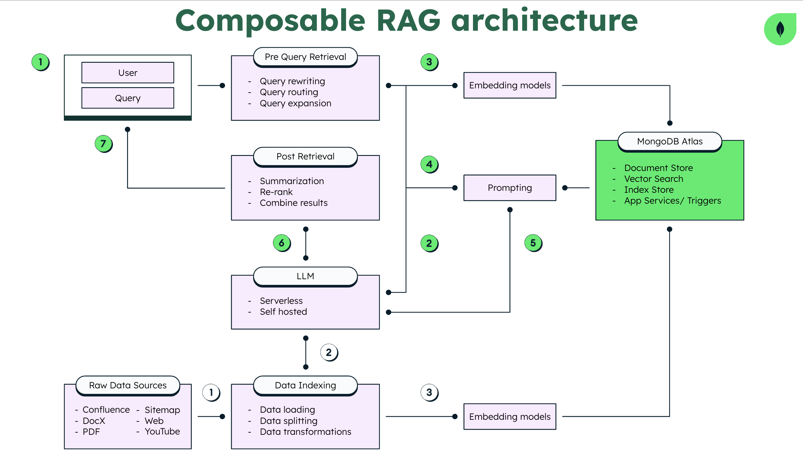

# Trip Planner

## Overview

Trip Planner is a web application designed to help users plan their trips efficiently. It leverages MongoDB for data storage and Amazon Bedrock (Anthropic Claude) for embedding and vector search capabilities. The application provides a user-friendly interface to input trip details and generates a detailed itinerary based on the provided information.



## Features

- **Hybrid Search**: Combines vector search and full-text search to provide relevant trip suggestions.
- **Google Maps Integration**: Displays trip locations on a map.
- **User Authentication**: Simple login mechanism to manage user sessions.
- **Dynamic Itinerary Generation**: Generates a detailed itinerary based on user input.
- **Responsive Design**: Ensures a seamless experience across different devices.

## Project Structure

```
trip_planner/
├── .env
├── .eslintrc.json
├── .gitignore
├── .next/
├── package.json
├── postcss.config.js
├── public/
├── src/
│   ├── app/
│   │   ├── api/
│   │   │   ├── chat/
│   │   │   │   └── route.ts
│   │   │   ├── upload/
│   │   │   │   └── route.ts
│   │   ├── component/
│   │   │   ├── cards.tsx
│   │   │   ├── chat.tsx
│   │   │   ├── googlemap.tsx
│   │   │   ├── markdown.tsx
│   │   │   ├── navbar.tsx
│   │   │   ├── prompt.tsx
│   │   │   └── prompt2.tsx
│   │   ├── fonts.css
│   │   ├── globals.css
│   │   ├── layout.tsx
│   │   ├── login/
│   │   │   └── page.tsx
│   │   ├── page.tsx
│   ├── utils/
│   │   └── mongodb.ts
├── tailwind.config.ts
├── tsconfig.json
└── ReadMe.md
```

## Installation

1. **Clone the repository**:
    ```sh
    git clone https://github.com/yourusername/trip_planner.git
    cd trip_planner
    ```

2. **Install dependencies**:
    ```sh
    npm install
    ```

3. **Set up environment variables**:
    Create a `.env` file in the root directory and add the following variables:
    ```env
    MONGODB_URI=your_mongodb_uri
    BEDROCK_AWS_REGION=your_aws_region
    BEDROCK_AWS_ACCESS_KEY_ID=your_aws_access_key_id
    BEDROCK_AWS_SECRET_ACCESS_KEY=your_aws_secret_access_key
    GOOGLE_MAP_API=your_google_map_api_key
    ```

4. **Run the development server**:
    ```sh
    npm run dev
    ```

5. **Build the project**:
    ```sh
    npm run build
    ```

6. **Start the production server**:
    ```sh
    npm start
    ```

## Usage

- **Login**: Navigate to the login page and enter your credentials.
- **Plan a Trip**: Use the form on the home page to input your trip details and generate an itinerary.
- **View Map**: See the locations of your trip on an integrated Google Map.

## Contributing

1. **Fork the repository**.
2. **Create a new branch**:
    ```sh
    git checkout -b feature/your-feature-name
    ```
3. **Make your changes**.
4. **Commit your changes**:
    ```sh
    git commit -m 'Add some feature'
    ```
5. **Push to the branch**:
    ```sh
    git push origin feature/your-feature-name
    ```
6. **Open a pull request**.

## License

This project is licensed under the MIT License.

## Acknowledgements

- [MongoDB](https://www.mongodb.com/)
- [Amazon Bedrock](https://aws.amazon.com/bedrock/)
- [Google Maps API](https://developers.google.com/maps)
- [LeafyGreen UI](https://www.mongodb.design/component/leafygreen-ui/)
